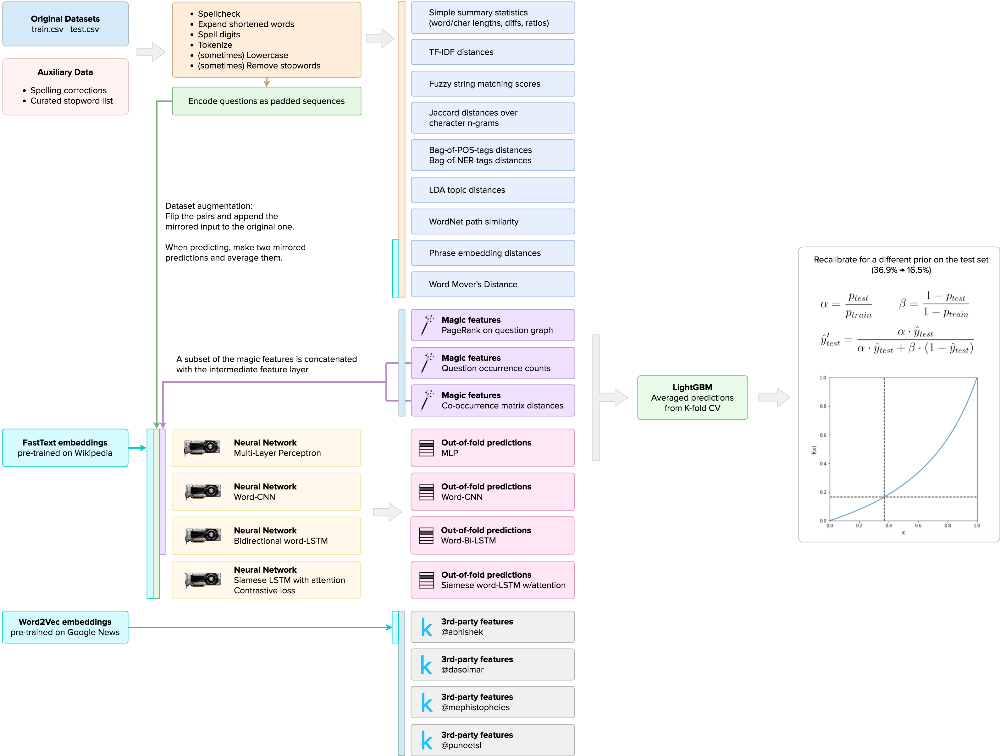

# kaggle-quora-question-pairs

My solution to [Kaggle Quora Question Pairs competition](https://www.kaggle.com/c/quora-question-pairs) (Top 2%, Private LB log loss 0.13497).


## Overview

The solution uses a mixture of purely statistical features, classical NLP features, and deep learning.
Almost 200 handcrafted features are combined with out-of-fold predictions from 4 neural networks having different architectures.

The final model is a GBM (LightGBM), trained with early stopping and a very small learning rate, using stratified K-fold cross validation.




## Reproducing the Solution


### Hardware Requirements

Almost all code (with the exception of some 3rd-party scripts) can efficiently utilize multi-core machines.
At the same time, some of them might be memory-hungry.
All code has been tested on a machine with 64 GB RAM.
For all non-neural notebooks, a `c4.8xlarge` AWS instance should do excellent.

For neural networks, a GPU is highly recommended.
On a GTX 1080 Ti, it takes about 8-9 hours to complete all 4 "neural" notebooks.

You'll need about 30 GB of free disk space to store the pre-trained word embeddings and the extracted features.

### Software Requirements

1. Python >= 3.6.
2. [LightGBM](https://github.com/Microsoft/LightGBM) (compiled from sources).
3. [FastText](https://github.com/facebookresearch/fastText) (compiled from sources).
4. Python packages from `requirements.txt`.
5. (Recommended) NVIDIA CUDA and a GPU version of TensorFlow.


### Environment Provisioning

You can spin up a fresh Ubuntu 16.04 AWS instance and use Ansible to make all the necessary software installation and configuration (except the GPU-related stuff).

1. Make sure to open the ports 22 and 8888 on the target machine.
2. Navigate to `provisioning` directory.
3. Edit `config.yml`:
    * `jupyter_plaintext_password`: the password to set for the Jupyter server on the target machine.
    * `kaggle_username`, `kaggle_password`: your Kaggle credentials (required to download the competition datasets).
      Otherwise, download them to the `data` folder manually.
4. Edit `inventory.ini` and specify your instance DNS and the private key file (*.pem) to access it.
5. Run:
    ```
    $ ansible-galaxy install -r requirements.yml
    $ ansible-playbook playbook.yml -i inventory.ini
    ```

### Running the Code

#### Automatic

Run `run-all.sh` from the repository root. Check `notebooks/output` for execution progress and `data/submissions` for the final results.

#### Manual

Start a Jupyter server in the `notebooks` directory. If you used the Ansible playbook, the server will already be running on port 8888.

Run the notebooks in the following order:

1. **Preprocessing**.
    ```
    1) preproc-tokenize-spellcheck.ipynb
    2) preproc-extract-unique-questions.ipynb
    3) preproc-embeddings-fasttext.ipynb
    4) preproc-nn-sequences-fasttext.ipynb
    ```

2. **Feature extraction**.

    Run all `feature-*.ipynb` notebooks in arbitrary order.
    
    *Note*: for faster execution, run all `feature-oofp-nn-*.ipynb` notebooks on a machine with a GPU and NVIDIA CUDA.
    
3. **Prediction**.

    Run `classify-lightgbm-cv-pred.ipynb`.
    The output file will be saved as `DATETIME-submission-draft-CVSCORE.csv`
